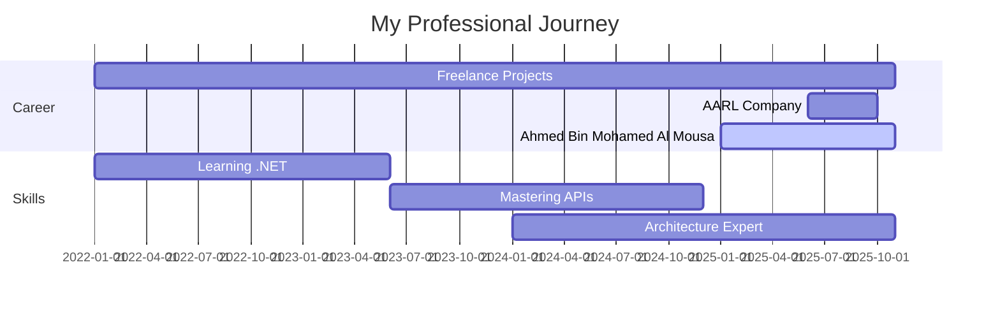

<div align="center">

<!-- Epic Animated Header with Cyberpunk Vibes -->


<br/>

<!-- Holographic Typing Animation -->
<a href="https://git.io/typing-svg">
  
</a>

<br/>

<!-- Neon Social Badges -->
<p align="center">
  <a href="https://github.com/abdullahmahmoud560">
    
  </a>
  <a href="https://www.linkedin.com/in/abdullah-mahmoud-3bb024311">
    
  </a>
  <a href="mailto:abdullah.mahmoud.abdelmohsen@gmail.com">
    
  </a>
  <a href="https://github.com/abdullahmahmoud560?tab=repositories">
    
  </a>
</p>

<br/>

<!-- Advanced Stats Badges -->
<p align="center">
  
  
  
</p>

<br/>

<!-- Animated Tech GIF Banner -->


</div>

<br/>

<!-- Glowing Divider -->


<br/>

---

##  About Me - Meet The Developer

<div align="center">


</div>

<br/>

<table>
<tr>
<td width="50%" valign="top">

### 👨‍💻 **Personal Info**

<table>
<tr>
<td width="30%">

</td>
<td width="70%">
<strong>Name</strong><br/>
<sub>Abdullah Mahmoud</sub>
</td>
</tr>
<tr>
<td>

</td>
<td>
<strong>Role</strong><br/>
<sub>Senior Backend Developer</sub>
</td>
</tr>
<tr>
<td>

</td>
<td>
<strong>Location</strong><br/>
<sub>📍 Cairo, Egypt</sub>
</td>
</tr>
<tr>
<td>

</td>
<td>
<strong>Company</strong><br/>
<sub>Ahmed Bin Mohamed Al Mousa Co.</sub>
</td>
</tr>
</table>

<br/>

### 🎯 **Core Competencies**


</td>
<td width="50%" valign="top">

### 🚀 **Current Focus**

<table>
<tr>
<td width="30%">

</td>
<td width="70%">
<strong>Working On</strong><br/>
<sub>Customs Clearance System</sub>
</td>
</tr>
<tr>
<td>

</td>
<td>
<strong>Learning</strong><br/>
<sub>.NET 9 Features & Microservices</sub>
</td>
</tr>
<tr>
<td>

</td>
<td>
<strong>Languages</strong><br/>
<sub>C#, SQL, JavaScript, Python</sub>
</td>
</tr>
<tr>
<td>

</td>
<td>
<strong>Open To</strong><br/>
<sub>Collaboration & Open Source</sub>
</td>
</tr>
</table>

<br/>

### 💭 **Developer Mindset**

<table>
<tr>
<td align="center" width="50%">

</td>
<td align="center" width="50%">

</td>
</tr>
<tr>
<td align="center">

</td>
<td align="center">

</td>
</tr>
</table>

<br/>


</td>
</tr>
</table>

<br/>

<div align="center">

### ⚡ **My Development Principles**

<table>
<tr>
<td align="center" width="25%">

<br/>
<strong>Clean Code</strong>
<br/>
<sub>Readable > Clever</sub>
</td>
<td align="center" width="25%">

<br/>
<strong>Security First</strong>
<br/>
<sub>Never Compromise</sub>
</td>
<td align="center" width="25%">

<br/>
<strong>Test Everything</strong>
<br/>
<sub>Quality Assurance</sub>
</td>
<td align="center" width="25%">

<br/>
<strong>Document Well</strong>
<br/>
<sub>Future-Proof Code</sub>
</td>
</tr>
</table>

<br/>

> 💡 **Life Motto:** *"Code is poetry written in logic. Make it beautiful, make it work, make it scale."*
> 
> ☕ **Fun Fact:** I debug with coffee and deploy with confidence! 🚀

</div>

<br/>

<div align="center">

### 🚀 **What Drives Me Forward?**


</div>

<table>
<tr>
<td width="50%" valign="top">

### 💭 **My Philosophy**

> **"Code is not just instructions for machines—it's communication with future developers, including your future self."**

<br/>

<table>
<tr>
<td width="20%" align="center">

</td>
<td width="80%">
<strong>🎨 Clean Code Advocate</strong><br/>
<sub>I believe in writing code that reads like poetry. Every function, every variable name, every comment matters.</sub>
</td>
</tr>
<tr>
<td width="20%" align="center">

</td>
<td width="80%">
<strong>🔐 Security First Mindset</strong><br/>
<sub>Security isn't a feature—it's a foundation. Every API endpoint I build is fortified from the ground up.</sub>
</td>
</tr>
<tr>
<td width="20%" align="center">

</td>
<td width="80%">
<strong>⚡ Performance Obsessed</strong><br/>
<sub>Milliseconds matter. I optimize queries, cache intelligently, and ensure scalability at every level.</sub>
</td>
</tr>
<tr>
<td width="20%" align="center">

</td>
<td width="80%">
<strong>📚 Lifelong Learner</strong><br/>
<sub>Technology evolves, and so do I. Always exploring new patterns, tools, and best practices.</sub>
</td>
</tr>
</table>

</td>
<td width="50%" valign="top">

### 💪 **Expertise Breakdown**

<br/>

**🎯 ASP.NET Core APIs**
<br/>

<br/>
<sub>⭐⭐⭐⭐⭐ Master Level | 15+ Projects</sub>

<br/>

**💾 Entity Framework Core**
<br/>

<br/>
<sub>⭐⭐⭐⭐⭐ Advanced | 12+ Projects</sub>

<br/>

**🏗️ Clean Architecture**
<br/>

<br/>
<sub>⭐⭐⭐⭐☆ Expert | 10+ Projects</sub>

<br/>

**🔒 Security & Authentication**
<br/>

<br/>
<sub>⭐⭐⭐⭐⭐ Master Level | 8+ Projects</sub>

<br/>

**🗄️ Database Design**
<br/>

<br/>
<sub>⭐⭐⭐⭐⭐ Advanced | 20+ Projects</sub>

<br/>

**🐳 Docker & DevOps**
<br/>

<br/>
<sub>⭐⭐⭐⭐☆ Proficient | 5+ Projects</sub>

</td>
</tr>
</table>

<br/>

<div align="center">

### 🎯 **What I Bring to the Table**

<table>
<tr>
<td align="center" width="25%">

<br/>
<strong>Problem Solver</strong>
<br/>
<sub>Turning complex challenges into elegant solutions</sub>
</td>
<td align="center" width="25%">

<br/>
<strong>Team Player</strong>
<br/>
<sub>Collaborative coding & knowledge sharing</sub>
</td>
<td align="center" width="25%">

<br/>
<strong>Quality Focus</strong>
<br/>
<sub>Testing, documentation & best practices</sub>
</td>
<td align="center" width="25%">

<br/>
<strong>Fast Delivery</strong>
<br/>
<sub>Agile mindset with quality results</sub>
</td>
</tr>
</table>

</div>

<br/>

> 💡 **Mission Statement:** *"I don't just write code—I architect scalable solutions that solve real-world problems. From securing authentication systems with JWT to designing enterprise-grade microservices, I'm passionate about turning complex business requirements into elegant, maintainable, and performant code that stands the test of time."*


##  Tech Arsenal - My Weapons of Choice

<div align="center">

### ⚔️ **Core Technologies**

<table>
<tr>
<td align="center" width="25%">

<br><strong>C#</strong>
<br><sub>Primary Language</sub>
</td>
<td align="center" width="25%">

<br><strong>.NET 8/9</strong>
<br><sub>Core Framework</sub>
</td>
<td align="center" width="25%">

<br><strong>REST APIs</strong>
<br><sub>API Architecture</sub>
</td>
<td align="center" width="25%">

<br><strong>ASP.NET Core</strong>
<br><sub>Web Framework</sub>
</td>
</tr>
</table>

<br/>

### 🗄️ **Database Mastery**

<table>
<tr>
<td align="center" width="20%">

<br><strong>SQL Server</strong>
</td>
<td align="center" width="20%">

<br><strong>PostgreSQL</strong>
</td>
<td align="center" width="20%">

<br><strong>MySQL</strong>
</td>
<td align="center" width="20%">

<br><strong>MongoDB</strong>
</td>
<td align="center" width="20%">

<br><strong>Redis</strong>
</td>
</tr>
</table>

<br/>

### 🛠️ **Development Tools**

<table>
<tr>
<td align="center" width="16.66%">

<br><strong>GitHub</strong>
</td>
<td align="center" width="16.66%">

<br><strong>Docker</strong>
</td>
<td align="center" width="16.66%">

<br><strong>VS 2022</strong>
</td>
<td align="center" width="16.66%">

<br><strong>VS Code</strong>
</td>
<td align="center" width="16.66%">

<br><strong>Postman</strong>
</td>
<td align="center" width="16.66%">

<br><strong>Git</strong>
</td>
</tr>
</table>

<br/>

### 🏗️ **Architecture & Patterns**


<br/><br/>

### 🔐 **Security & Authentication**

<table>
<tr>
<td align="center" width="25%">

<br><strong>JWT Auth</strong>
</td>
<td align="center" width="25%">

<br><strong>OAuth 2.0</strong>
</td>
<td align="center" width="25%">

<br><strong>ASP.NET Identity</strong>
</td>
<td align="center" width="25%">

<br><strong>Data Encryption</strong>
</td>
</tr>
</table>

<br/>

### 🧪 **Testing & Quality**


<br/><br/>

### 📊 **Most Used Languages**


</div>


##  Professional Journey - Building the Future

<div align="center">


</div>

<table>
<tr>
<td width="30%" align="center" valign="top">


### 💼 Current Role

**Backend Developer**


📅 **Jan 2025 - Present**

</td>
<td width="70%" valign="top">

### 🏢 **Ahmed Bin Mohamed Al Mousa Company**

#### 🚛 **Customs Clearance System** - Enterprise Solution

Leading the backend development of a comprehensive customs clearance platform that streamlines international trade operations.

**🎯 Key Achievements:**

```typescript
✅ Architected & built 25+ RESTful API endpoints
✅ Implemented JWT-based authentication system
✅ Designed role-based authorization (RBAC) framework
✅ Optimized database queries (40% performance boost)
✅ Applied Clean Architecture & SOLID principles
✅ Integrated real-time notifications system
```

**💻 Tech Stack:**
<br/>


</td>
</tr>
</table>

<br/>

<table>
<tr>
<td width="30%" align="center" valign="top">


### ⚖️ Previous Role

**Backend Developer**


📅 **Jun 2025 - Oct 2025**

</td>
<td width="70%" valign="top">

### 🏛️ **AARL Company**

#### 📁 **Law & Case Management System** - Legal Tech Solution

Developed a cutting-edge law firm management platform with AI-powered features and Microsoft ecosystem integration.

**🎯 Key Achievements:**

```typescript
✅ Built complete case management REST API
✅ Integrated Microsoft Graph API for Office 365
✅ Implemented OpenAI GPT for smart case summaries
✅ Automated email & calendar synchronization
✅ Document management with version control
✅ Real-time collaboration features
```

**💻 Tech Stack:**
<br/>


</td>
</tr>
</table>

<br/>

<table>
<tr>
<td width="30%" align="center" valign="top">


### 🚀 Side Projects

**Freelance Developer**


📅 **Continuous**

</td>
<td width="70%" valign="top">

### 💡 **Freelance & Academic Projects**

#### 🌟 **Diverse Portfolio of Solutions**

Building innovative solutions across multiple domains, from e-commerce to education technology.

**🎯 Project Categories:**

<table>
<tr>
<td width="50%">

**🛒 E-Commerce Platforms**
- Payment gateway integration
- Order management systems
- Inventory tracking APIs
- Customer loyalty programs

**📚 Educational Systems**
- Student management platforms
- Online learning APIs
- Grade tracking systems
- Attendance management

</td>
<td width="50%">

**⚽ Sports Management**
- Academy management APIs
- Player registration systems
- Schedule & booking systems
- Performance analytics

**🤖 AI-Powered Solutions**
- Academic guidance systems
- Smart recommendation engines
- Natural language processing
- Data analytics dashboards

</td>
</tr>
</table>

**💻 Technologies Used:**
<br/>


</td>
</tr>
</table>

<br/>

<div align="center">

### 📈 **Career Growth Timeline**



</div>


##  Featured Projects - My Digital Creations

<div align="center">


### 🚀 **Portfolio Highlights**

</div>

<br/>

<table>
<tr>
<td width="50%" valign="top">

<div align="center">

### 🎓 **AI-Powered Academic Guidance System**


<br/>

[](https://github.com/abdullahmahmoud560/finalProject)

</div>

#### 📋 **Project Overview**

An intelligent academic guidance platform that leverages AI to help students make informed decisions about their educational paths.

#### 🔧 **Technologies**


#### ✨ **Key Features**

```yaml
✅ Smart course recommendations
✅ Career path analysis
✅ Performance tracking
✅ Personalized learning plans
✅ Real-time analytics dashboard
```

<div align="center">

[](https://github.com/abdullahmahmoud560/finalProject)
[](#)

</div>

</td>

<td width="50%" valign="top">

<div align="center">

### ⚽ **Sports Academy Management API**


<br/>

[](https://github.com/abdullahmahmoud560/Sports)

</div>

#### 📋 **Project Overview**

A comprehensive REST API for managing sports academies, including player registration, scheduling, and performance analytics.

#### 🔧 **Technologies**


#### ✨ **Key Features**

```yaml
✅ Player management system
✅ Training schedule automation
✅ Payment processing
✅ Performance analytics
✅ RESTful API architecture
```

<div align="center">

[](https://github.com/abdullahmahmoud560/Sports)
[](#)

</div>

</td>
</tr>
</table>

<br/>

<div align="center">

### 🎯 **More Projects Coming Soon...**


<br/><br/>

[](https://github.com/abdullahmahmoud560?tab=repositories)

</div>


##  GitHub Analytics - Numbers That Tell My Story

<div align="center">


<br/><br/>

### 📊 **Performance Metrics**

<table>
<tr>
<td width="50%" align="center">


</td>
<td width="50%" align="center">


</td>
</tr>
</table>

<br/>

### 🏆 **GitHub Trophies**


<br/>

### 📈 **Contribution Graph**


<br/>

### 💻 **Language Distribution**

<table>
<tr>
<td width="50%" align="center">


</td>
<td width="50%" align="center">


</td>
</tr>
</table>

<br/>

### 🎯 **Coding Stats**


<br/>

<table>
<tr>
<td width="33%" align="center">


</td>
<td width="33%" align="center">


</td>
<td width="33%" align="center">


</td>
</tr>
</table>

<br/>

### 🌟 **Recent Activity**

<!--START_SECTION:activity-->
<!--END_SECTION:activity-->

<br/>


</div>


##  Let's Build Something Amazing Together!

<div align="center">


<br/><br/>

### 💬 **Open to Opportunities**

<table>
<tr>
<td align="center" width="33%">

<br/>
<h3>🤝 Collaboration</h3>
<p>Let's work together on exciting projects!</p>
</td>
<td align="center" width="33%">

<br/>
<h3>💼 Job Opportunities</h3>
<p>Open to full-time & freelance roles</p>
</td>
<td align="center" width="33%">

<br/>
<h3>💡 Consultation</h3>
<p>Need help with your backend?</p>
</td>
</tr>
</table>

<br/>

### 📫 **Reach Me At**

<table>
<tr>
<td align="center">

<a href="mailto:abdullah.mahmoud.abdelmohsen@gmail.com">

</a>
<br/>
<sub>abdullah.mahmoud.abdelmohsen@gmail.com</sub>

</td>
<td align="center">

<a href="https://www.linkedin.com/in/abdullah-mahmoud-3bb024311">

</a>
<br/>
<sub>Abdullah Mahmoud</sub>

</td>
<td align="center">

<a href="https://github.com/abdullahmahmoud560">

</a>
<br/>
<sub>@abdullahmahmoud560</sub>

</td>
</tr>
</table>

<br/>

### 🌐 **Find Me Around the Web**

<a href="https://github.com/abdullahmahmoud560">
  
</a>
<a href="https://www.linkedin.com/in/abdullah-mahmoud-3bb024311">
  
</a>
<a href="mailto:abdullah.mahmoud.abdelmohsen@gmail.com">
  
</a>
<a href="https://stackoverflow.com">
  
</a>
<a href="https://twitter.com">
  
</a>
<a href="https://dev.to">
  
</a>

<br/><br/>

### 💌 **Quick Response Time**


<br/><br/>

<!-- Snake Animation eating contributions -->
<picture>
  <source media="(prefers-color-scheme: dark)" srcset="https://raw.githubusercontent.com/platane/snk/output/github-contribution-grid-snake-dark.svg">
  <source media="(prefers-color-scheme: light)" srcset="https://raw.githubusercontent.com/platane/snk/output/github-contribution-grid-snake.svg">
  
</picture>

<br/><br/>

</div>


<div align="center">

## 💖 **Support My Work**

<br/>


<br/><br/>

### ⭐ **Show Some Love**

<p>If you find my work helpful, consider giving a ⭐ to my repositories!</p>
<p>It helps me stay motivated and continue building awesome projects 🚀</p>

<br/>

<a href="https://github.com/abdullahmahmoud560?tab=repositories">

</a>

<br/><br/>

### 📊 **Profile Stats**


<br/><br/>


<br/><br/>

---

<br/>

### 🎯 **Fun Fact**

```javascript
const developer = {
    name: "Abdullah Mahmoud",
    role: "Backend Developer",
    languages: ["C#", "SQL", "JavaScript"],
    currentlyLearning: [".NET 9", "Microservices", "Cloud Architecture"],
    funFact: "I can turn coffee ☕ into clean, scalable code 💻",
    motto: "Write code that humans can read! 📖"
};

// Life = Code + Coffee + Commits
while (alive) {
    eat();
    sleep();
    code();
    repeat();
}
```

<br/>

### 🌟 **Thank You for Visiting!**


<p>Every visitor makes my day! Thanks for stopping by 😊</p>
<p><strong>Let's connect and create something extraordinary together! 🚀</strong></p>

<br/>


</div>

---

<div align="center">

<sub>⚡ Made with ❤️ by Abdullah Mahmoud | © 2025 All Rights Reserved</sub>

<br/>


</div>
